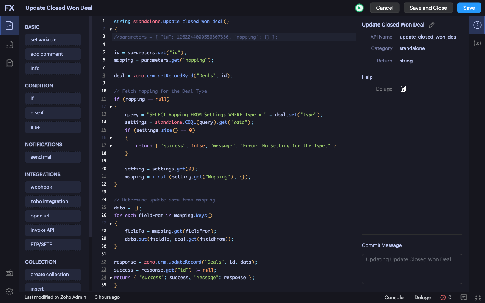

# Zoho CRM DevTools

[](https://github.com/neilord/zoho-crm-devtools/actions/workflows/ci.yml)
[Chrome Web Store](https://chromewebstore.google.com/detail/zoho-crm-devtools/mjcppmfgjpllmmoneiaegecjlcpbfgmi)

Zoho CRM DevTools is a Chrome extension that improves the Zoho CRM Deluge function editor with cleaner themes, indent guides, and practical syntax highlighting.

The extension stays close to Zoho's own editor UI. It does not replace the editor or send code to an external service.



## Features

- Custom editor themes: VS Code Dark, VS Code Light, GitHub Light, GitHub Dark, One Dark Pro, Monokai Pro, and Tokyo Night
- Indent guides for long Deluge functions
- Improved syntax highlighting on top of Zoho's existing CodeMirror output
- Minimal popup with an enable/disable switch
- No backend, analytics, or network calls in the current extension

## Permissions And Privacy

Current production builds request:

- `storage`, used only for editor preferences
- Content script access on Zoho CRM and Zoho Portal domains, used to style and improve the Deluge editor in the page

The extension stores settings such as enabled state, selected theme, font preferences, indent guide preference, and syntax highlighting preference. These settings are saved with Chrome extension storage. If Chrome sync is enabled, Chrome may sync them through the user's Google account; they are not sent to ZSetup servers.

See [PRIVACY.md](PRIVACY.md) for the full permissions and data-use breakdown.

## Install

Install the published extension from the [Chrome Web Store](https://chromewebstore.google.com/detail/zoho-crm-devtools/mjcppmfgjpllmmoneiaegecjlcpbfgmi).

## Development

Requirements:

- Node.js 20+
- npm

Install dependencies:

```sh
npm ci
```

Run the full local verification suite:

```sh
npm run verify
```

Build the production extension:

```sh
npm run build
```

Package the extension for upload:

```sh
npm run zip
```

For local browser testing, build the extension and load the generated `dist/` directory through Chrome's "Load unpacked" flow. Development-only reload helpers are available through:

```sh
npm run build:dev
```

See [docs/development-workflow.md](docs/development-workflow.md) for the live Zoho verification workflow.

## Project Structure

- `manifest.config.ts`: Chrome Manifest V3 configuration
- `src/content`: content scripts and Zoho editor integration
- `src/themes`: theme registry and theme CSS
- `src/syntax`: Deluge syntax enhancement
- `src/settings`: typed settings and storage
- `src/popup`: extension popup
- `tests`: unit and DOM fixture tests
- `docs`: architecture notes, testing notes, roadmap, and store listing assets

## Roadmap

The current open-source base focuses on editor readability. Later ideas include:

- Smarter find and navigation for large functions
- Code folding
- Better Deluge-aware autocomplete
- Inline checks where they can be implemented safely

Future paid features, if any, should be additive and premium from launch. Existing free features are not planned to move behind a paywall.

## Security

Please do not include CRM customer data, private Deluge code, screenshots with customer records, or credentials in public issues or pull requests.

Report security concerns using the process in [SECURITY.md](SECURITY.md).

## License

Zoho CRM DevTools is open source under the [MIT License](LICENSE).

The code license does not grant rights to reuse the project name, extension icons, logos, or Chrome Web Store identity in a confusing way. See [TRADEMARKS.md](TRADEMARKS.md).

Zoho CRM DevTools is an independent project and is not affiliated with, endorsed by, or sponsored by Zoho Corporation.
